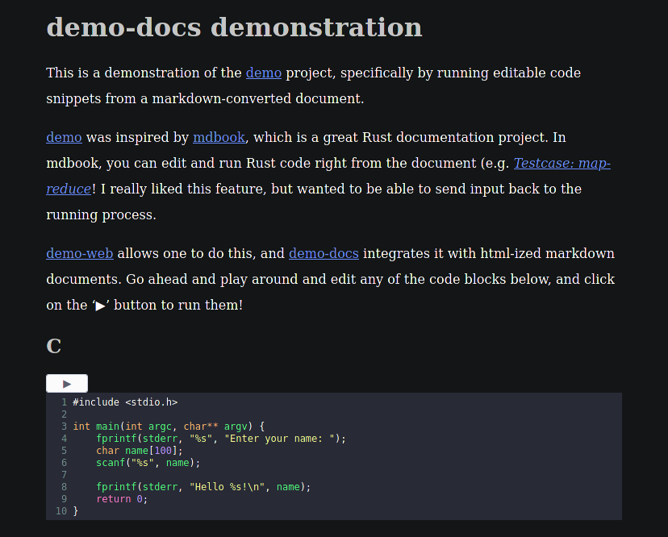

# demonic docs

Demonic documentation for running code snippets in a sandboxed environment.

[](https://demo.liambeckman.com/docs.html)

# Installation

```sh
# get code
git clone https://github.com/lbeckman314/demo-docs
cd demo-docs

# install dependencies
npm install

# bundle webpack
npm run build
```

Then you can use your favorite browser to open 'docs.html'. Each code snippet should be editable and runnable.

To convert the default 'docs.md' file to a new 'docs.html' file, enter:

```sh
pandoc -f markdown -t html -s docs.md -o docs.html -H head.html
```

# Uninstallation

```sh
# remove this directory
rm -rfI demo-docs
```

