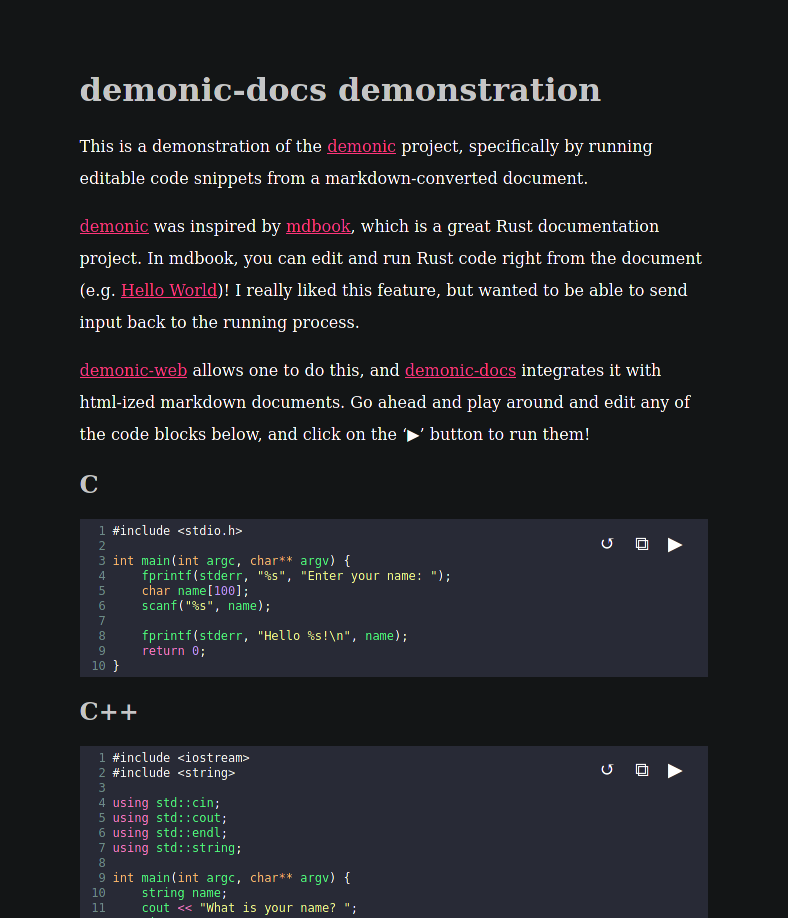

# demonic-docs

Demonic documentation for running code snippets in a sandboxed environment.

Try it out at [liambeckman.com/code/demonic](https://liambeckman.com/code/demonic).

[](https://liambeckman.com/code/demonic)

# Installation

```sh
git clone https://github.com/lbeckman314/demonic-docs
cd demonic-docs

# install dependencies
npm install

# bundle webpack
npm run build
```

Then you can use your favorite browser to open `sites/docs.html`. Each code snippet should be editable and runnable.



To convert the default `docs.md` file to a new `docs.html` file, enter:

```sh
cd site
pandoc -f markdown -t html -s docs.md -o docs.html -H head.html
```

# Uninstallation

```sh
# remove this directory
rm -rfI demonic-docs
```

